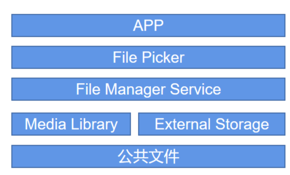

# File Mangaer Service公共文件管理服务<a name="ZH-CN_TOPIC_0000001147574647"></a>

- [简介](#section1158716411637)
- [目录](#section161941989596)
- [使用说明](#usage-guidelines)
    - [创建文件](#get-audioasset)
- [相关仓](#section1533973044317)


## 简介<a name="section1158716411637"></a>

**File Mangaer Service**公共文件管理服务仓库提供了公共文件管理接口。File Mangaer Service接口暂不对外部应用开放, 仅内部使用。

支持能力列举如下：
- 公共文件路径下媒体文件查询，创建
    媒体文件包括图片，音频，视频。媒体文件通过相册方式呈现
    
- 公共文件路径下文档文件查询、创建

    文档文件包括其他文件，外部存储卡内的文件，文件以目录树方式呈现

**图 1**  公共文件管理架构图<a name="fig174088216114"></a>


## 目录<a name="section161941989596"></a>

仓目录结构如下:
```
/foundation/storage/user_file_manger            # fms组件代码
├── figures                                     # 插图文件
├── serivce                                     # 框架代码
│   ├── etc                                     # 内部接口实现
│   ├── src                                     # 内部接口实现
├── interfaces                                  # 接口代码
│   ├── innerkits                               # 内部 Native 接口
│   └── kits                                    # 外部 JS 接口
├── LICENSE                                     # 证书文件
├── ohos.build                                  # 编译文件
├── sa_profile                                  # 服务配置文件
└── services                                    # 服务实现
```

## 使用说明<a name="usage-guidelines"></a>
### 创建文件<a name="get-audioasset"></a>
1.
    接口流程
    应用通过接口让媒体库创建文件，返回文件uri, 应用自己通过openfile打开uri，获取fd进行文件操作。

    // file picker  流程
    // media_path通过filepicker获取待保存目录uri
    import filemanager from '@ohos.filemanager'
    let media_path = "xxxx"
    let name = "xxxx"
    filemanager.createFile(name，media_path)
        .then((uri) => {
            // success
        })
        .catch(function(err) {
            //类型错误，重名...
            // fail
        })
    ```

## 相关仓<a name="section1533973044317"></a>
