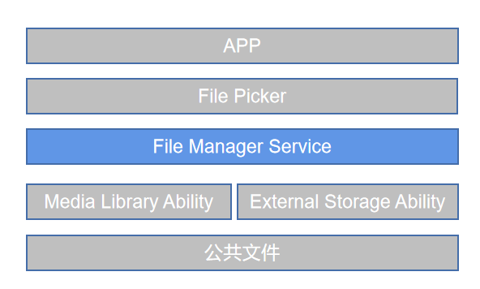

# 公共文件管理<a name="ZH-CN_TOPIC_0000001147574647"></a>

## 简介<a name="section1158716411637"></a>

公共文件管理提供了公共文件管理接口。

公共文件的管理中File Manager Service服务向下对接底层文件管理服务，如媒体库、外卡管理。File Manager Service服务向上对接应用提供公共文件查询、创建的能力，如图1。 File Manager Service接口能力当前只对系统应用如文件选择器提供。

支持能力列举如下：
- 查询、创建公共文件路径下媒体文件。媒体文件包括图片、音频、视频。媒体文件通过相册方式呈现。

- 查询、创建公共文件路径下文档文件。文档文件包括其他文件、外部存储卡内的文件。文件以目录树方式呈现。

**图 1**  公共文件管理架构图<a name="fig174088216114"></a>


## 目录<a name="section161941989596"></a>

仓目录结构如下:
```
/foundation/storage/user_file_service
├── figures                                     # 插图文件
├── serivce                                     # 服务实现
│   ├── etc                                     # 内部接口实现
│   ├── src                                     # 内部接口实现
├── interfaces                                  # 接口代码
│   ├── innerkits                               # 内部 Native 接口
│   └── kits                                    # 外部 JS 接口
├── LICENSE                                     # 证书文件
├── ohos.build                                  # 编译文件
└── sa_profile                                  # 服务配置文件
```
## 说明<a name="guide"></a>
### 使用说明<a name="usage-guidelines"></a>
1. 创建文件
   - 提供createFile接口，传入文件名与相册uri进行文件创建。
   - 文件创建成功后，可获得文件uri。应用可通过uri进行文件打开并进行读写操作。
2. 查询文件
   - 提供listFile接口，传入文件类型、相册uri进行文件查询。
   - 获得相册下文件信息的集合，包括文件名、文件类型、文件大小、文件创建时间等信息。